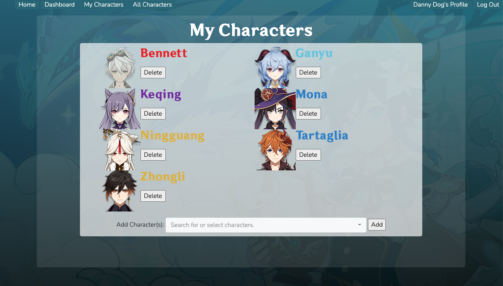
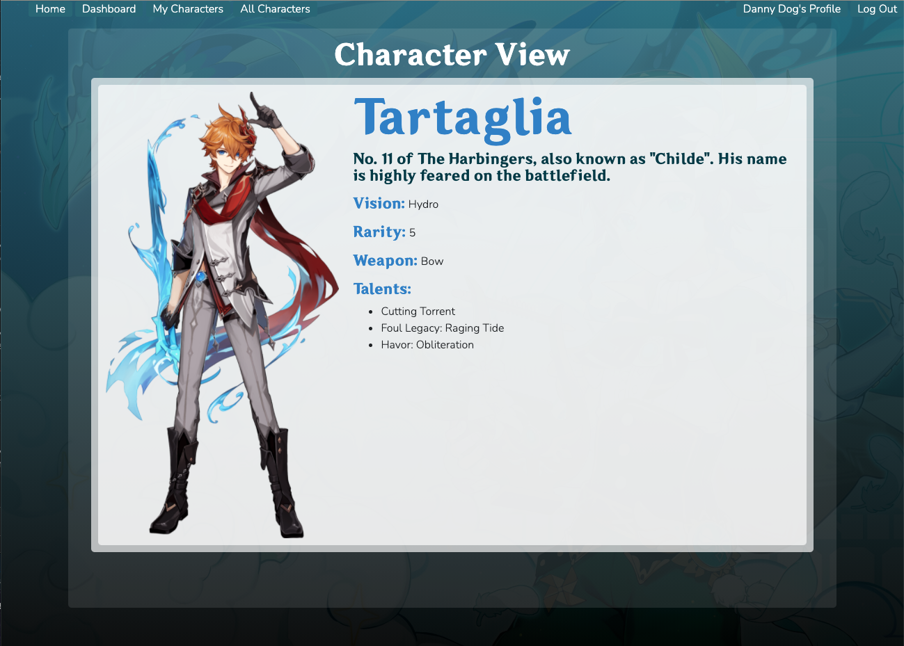
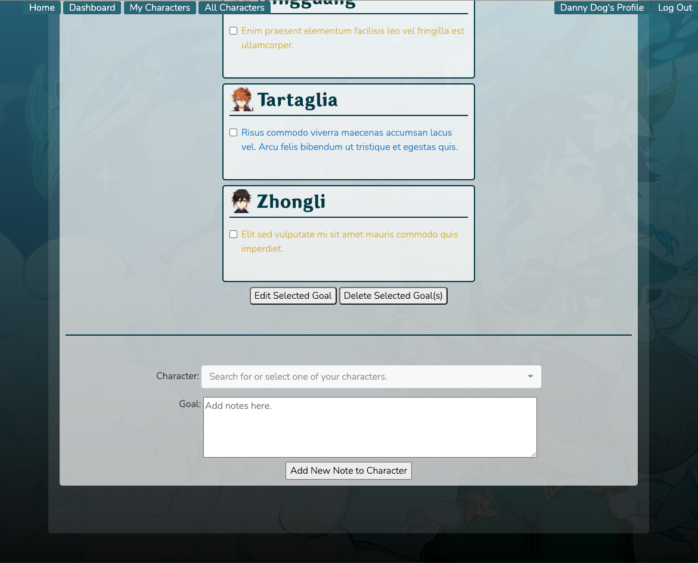
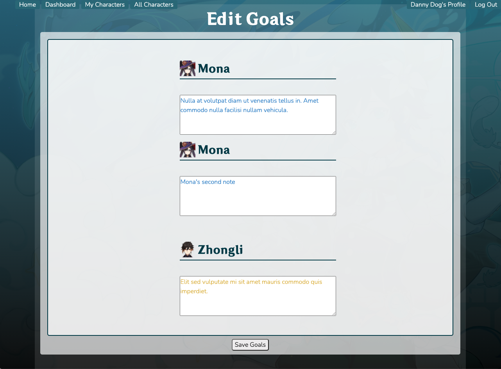

# Genshin Impact Character Tracker
A browser-based app for manually tracking your Genshin Impact characters and their stats, and for managing your in-game goals.

The purpose of this project is to have all your character information stored online, which you can bookmark or keep open in a tab, and which takes less time to load than the actual game itself. You can add, edit, and delete your goals or notes for each character in the dashboard view--no need to flip through pages of crossed-out notes anymore!

## Link to Live Project:
https://genshin-impact.herokuapp.com/

Test account:  
Email: test@email.com  
Password: test

## How to Setup After Cloning:
1. Install node dependencies: 
```npm install```
- Install the Sequelize CLI if you don't have it already: `npm i sequelize-cli` or `npm i -g sequelize-cli` to install globally

2. Create a SQL database called "genshin_tracker" (Make sure that the config.json database name matches your database name): `psql`, `CREATE DATABASE genshin_tracker;`
3. Migrate models: `sequelize db:migrate`
4. Run the API to populate the stockCharacter model: `node server_api.js`
5. Run the code: `node server.js` or `nodemon` (if you have nodemon installed)
6. Go to port 3000 in your browser: `localhost:3000`

## Features
- Sequelize hook to convert email address before validating 
- Password hashing using bcrypt
- Local login authentication using passport
- Multi-select and search from a dynamic dropdown list when adding characters
- Multi-select edit and delete character comments
- Dynamic CSS: see what happens when you adjust your browser size 👀
- Colored text dependent on each character's vision (element)

## Technologies Used
- HTML
- CSS, Scss
- JavaScript
- Express
- Node.js
- EJS, EJS Layouts 
- Bootstrap, Bootstrap-select
- Axios (for API calls)
- Passport (for user authentication)
- Bcrypt (for password hashing)

## Next Steps
- Update Characters view  to match Figma wireframes
- Add ability to enter character stats (ATK, DEF, HP, etc.)  
- Add weapon slot and domain information 
- Aggregate domain information on dashboard, depending on the day 

## Contact: 
Reach out to Trisha at genshin.character.tracker@gmail.com for comments or inquiries!

--- 

## Project Planning:
Entity Relationship Diagram: https://lucid.app/lucidchart/invitations/accept/18a984d6-26ce-4ce0-a51e-ee6e22bc8714

Wireframes: https://www.figma.com/file/YYpdBfzQkJaAiz9c5pFhUF/Genshin-Character-Tracker-Wireframes?node-id=0%3A1
Inspiration: 
- https://genshin.gg/
- https://www.gensh.in/
- https://genshin.poporing.life/
- https://www.genshingamer.com/

## Timeline
Click [here](notes/timeline.md) (notes/timeline.md) for a more detailed progress timeline. 
1/20/21 - Found and added Genshin custom font

1/21/21 - Added background and EJS layout scss, 404 page  

1/23/21 - Minimized scope of project, added user model  

1/25/21 - Added login authentication, password hashing, flash messages, navbar, character and goal models    

1/26/21 - Populated stockCharacter model with API, added bootstrap-select multi-select+search form for adding characters, incorporated ability to view all and delete characters, aligned link formatting in the navigation bar. 

1/27/20 - Added multi-select form with user's characters to dashboard page, added ability to add comments/notes for each character, and display them grouped by character

1/28/20 - Added ability to bulk edit or bulk delete comments using the same form. Refactored 'add new character' multi-select search form to be based on stockCharacters, instead of having hard-coded dropdown values.  

## Screenshots
My Characters view:

Character detail view:

My Goals view:

Add Goal view:

Edit Goals view:
 

## Background:
Whenever I talk about anything related to my characters in Genshin Impact on Reddit or with my friends--such as character builds or team compositions--I find that I oftentimes have to open the game just to see what my character's stats are, the name and level of their weapon they're using, or which artifacts (plus their main- and sub- stats) they have equipped. 

I also keep forgetting if I can use my resin (i.e. Genshion's stamina currency) on artifacts, or whether I should use them on today's ascension domains. 

And I'll forget which specific artifacts I'm farming for each character (in order to fulfill artifact set bonuses): Whenever I see my domain drops, I have to find my physical list of artifacts so I can know whether I'm done running a domain or whether I should continue to do another run.

This app arose from the intersection of the pain points above, and the exigence below. 

## Exigence: 
This app is my unit 2 project for General Assembly's Software Engineering Intensive (GA SEI). [Requirements](https://github.com/patricia-pan/project2_ideas) include:  
- Have at least 2 models (more if they make sense) that represents the main functional idea for your app. This doesn't include join tables or the user model which should be part of your class's boilerplate code.  
- Include sign up/log in functionality, with hashed passwords & an authorization flow
- Incorporate at least one API. Examples include Yelp, Tumblr, Facebook, and others on Mashape. Maybe grab an API from this list of free APIs
- Have complete RESTful routes for at least one of your resources with GET, POST, PUT, and DELETE
- Utilize an ORM to create a database table structure and interact with your relationally-stored data
- Include a readme file that explains how to use your app
- Have semantically clean HTML, CSS, and back-end code
- Be deployed online and accessible to the public

## Credit:
Character information API: https://github.com/genshindev/api  
Background image: https://www.gensh.in/gallery/wallpaper#lg=1&slide=0 
